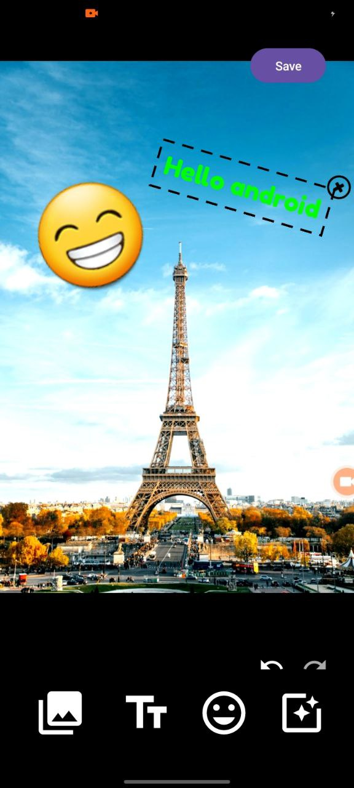
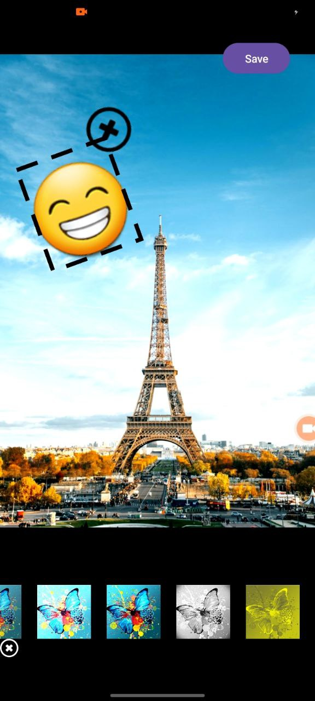
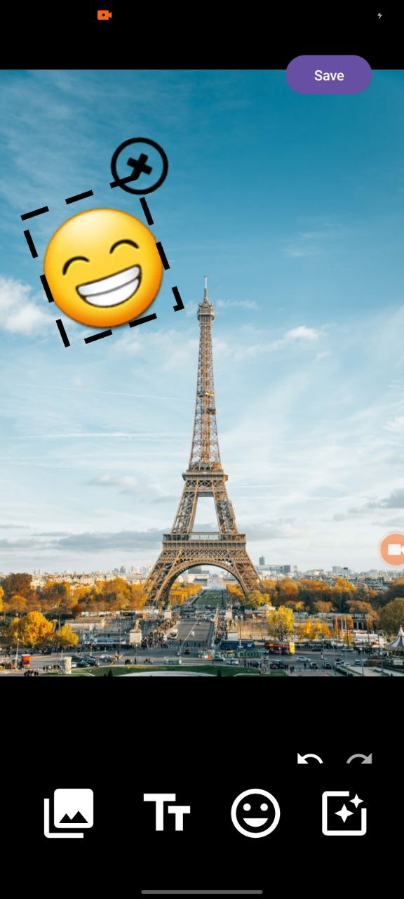

# 📸 PhotoMaster – Creative Photo Editor

> **PhotoMaster** is a powerful yet simple photo editing app that allows you to unleash your creativity. Add emojis, style your text with different fonts and colors, scale elements with ease, and apply beautiful filters to transform your photos instantly.

---

## ✨ Features

✅ **Emoji Fun** – Add hundreds of emojis to your pictures for a playful touch.  
✅ **Custom Text** – Insert text with **custom fonts**, **vibrant colors**, and **shadows**.  
✅ **Resize & Rotate** – Scale elements **large or small** with pinch gestures.  
✅ **Stunning Filters** – Apply various **image effects** to completely change the mood.  
✅ **User-Friendly UI** – Smooth and intuitive editing experience.  
✅ **Offline Support** – Works without internet.

---

## 📷 Screenshots

| Editing Screen | Adding Emoji | Applying Filters |
| --- | --- | --- |
|  |  |  |

---

## 🎥 Demo GIF


---

## 📥 Installation

[Download the latest **APK**](https://github.com/ksanjardev/Photo_editor/raw/master/photo_editor.apk)

1. Download `PhotoMaster.apk`.
2. Transfer it to your Android device.
3. Open and install it (make sure to enable installation from unknown sources in settings).

---

## 🛠 Tech Stack

- **Language:** Kotlin / Java
- **Framework:** Android SDK
- **Image Processing:** OpenGL / Android Graphics
- **UI:** Material Design

---

## 🚀 Getting Started (For Developers)

Clone the repository:
```bash
git clone https://github.com/ksanjardev/Photo_editor.git
